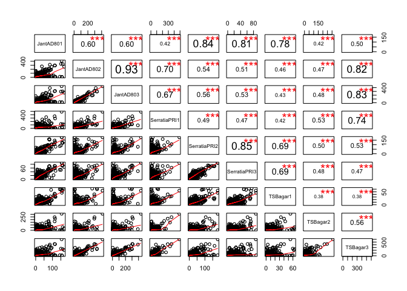

Multivariate Analysis Steps for Feature Matrix 2
================

Author: Purva Kulkarni Date: 11 July 2016

This documents contains code snippets to perform multivariate analysis performed on the feature matrix 2 obtained after preprocessed the MS peaklists (Code for preprocessing: `processPeaklists.R`. The preprocessing steps do contain steps perform alignment and calibration. The parameters for baseline correction and peak detection are fine tuned.

Read the featureMatrix 2 from the .csv file, create column and row headers and view

``` r
data <- read.csv("FeatureMatrix2.csv", header = TRUE)
data2 <- cbind(data$V1, data$V2, data$V3, data$V4, data$V5, data$V6, data$V7, data$V8, data$V9)
colnames(data2) <- c("JantAD801", "JantAD802", "JantAD803", "SerratiaPRI1", "SerratiaPRI2", "SerratiaPRI3", "TSBagar1", "TSBagar2", "TSBagar3")
temp1 <- c(data$X)
temp1 <- as.character(round(temp1, digits = 4))
rownames(data2) <- temp1
head(data2)
```

    ##          JantAD801 JantAD802  JantAD803 SerratiaPRI1 SerratiaPRI2
    ## 150.01   0.2262552 5.0583301 0.71915305    20.431528  0.000000000
    ## 150.2367 0.4575077 0.4898127 0.66587079     0.000000  0.773118846
    ## 150.3529 0.1715466 0.3493053 0.02857163     1.989367  0.812344454
    ## 150.6544 2.1522503 0.8873636 0.43816244     2.833047  0.009361039
    ## 150.8854 3.1889920 2.8897966 0.80573752     0.000000  3.384660200
    ## 150.9752 2.9809864 3.1890006 8.02928864    25.704326  6.262453001
    ##          SerratiaPRI3   TSBagar1 TSBagar2   TSBagar3
    ## 150.01      1.7275988 15.1358193 0.000000  0.0000000
    ## 150.2367    0.3772960  0.3292438 0.000000  0.6424956
    ## 150.3529    0.1477674  0.0000000 0.000000  0.8545647
    ## 150.6544    3.2489518  2.6086870 0.000000  0.2490793
    ## 150.8854    6.0718052  5.3876118 0.000000  0.0000000
    ## 150.9752    6.0913385  6.2343211 1.521629 29.4021088

View pair wise scatter plots and their correlations

``` r
panel.cor <- function(x, y, digits=2, prefix="", cex.cor) 
{
  usr <- par("usr"); on.exit(par(usr)) 
  par(usr = c(0, 1, 0, 1)) 
  r <- abs(cor(x, y)) 
  txt <- format(c(r, 0.123456789), digits=digits)[1] 
  txt <- paste(prefix, txt, sep="") 
  if(missing(cex.cor)) cex <- 0.8/strwidth(txt) 
  
  test <- cor.test(x,y) 
  # borrowed from printCoefmat
  Signif <- symnum(test$p.value, corr = FALSE, na = FALSE, 
                   cutpoints = c(0, 0.001, 0.01, 0.05, 0.1, 1),
                   symbols = c("***", "**", "*", ".", " ")) 
  
  text(0.5, 0.5, txt, cex = cex * r) 
  text(.8, .8, Signif, cex=cex, col=2) 
}
pairs(data2, lower.panel=panel.smooth, upper.panel=panel.cor)
```



Transform the `data2` matrix, convert the matrx to a `data.frame` and add a `Species` column to the this matrix.

``` r
data2Transformed <- t(data2)
Species <- c("JantAD80", "JantAD80", "JantAD80", "SerratiaPR", "SerratiaPR", "SerratiaPR", "TSBAgar", "TSBAgar", "TSBAgar")
data2Transformed <- as.data.frame(data2Transformed)
Species <- as.factor(Species)
data2Transformed <- cbind(data2Transformed, Species)
df <- data2Transformed[c(1:length(data2Transformed)-1)]
library(ggfortify)
```

    ## Warning: package 'ggfortify' was built under R version 3.2.5

    ## Loading required package: ggplot2

    ## Warning: package 'ggplot2' was built under R version 3.2.4

``` r
autoplot(prcomp(df), data = data2Transformed, colour = 'Species', label  =TRUE, label.size = 4, loadings = TRUE, loadings.colour = 'black', loadings.label = TRUE, loadings.label.size = 4, loadings.label.colour = 'Navyblue')
```


``` r
summary(prcomp(df))
```

    ## Importance of components:
    ##                            PC1      PC2       PC3       PC4       PC5
    ## Standard deviation     617.876 274.6459 228.95180 193.58145 143.91419
    ## Proportion of Variance   0.645   0.1274   0.08856   0.06331   0.03499
    ## Cumulative Proportion    0.645   0.7724   0.86099   0.92430   0.95929
    ##                              PC6      PC7      PC8       PC9
    ## Standard deviation     117.66487 84.45949 55.81905 2.104e-13
    ## Proportion of Variance   0.02339  0.01205  0.00526 0.000e+00
    ## Cumulative Proportion    0.98268  0.99474  1.00000 1.000e+00
