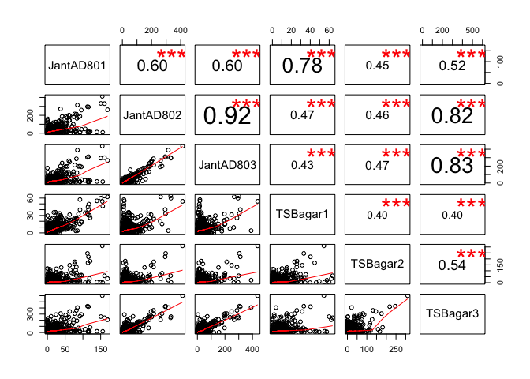
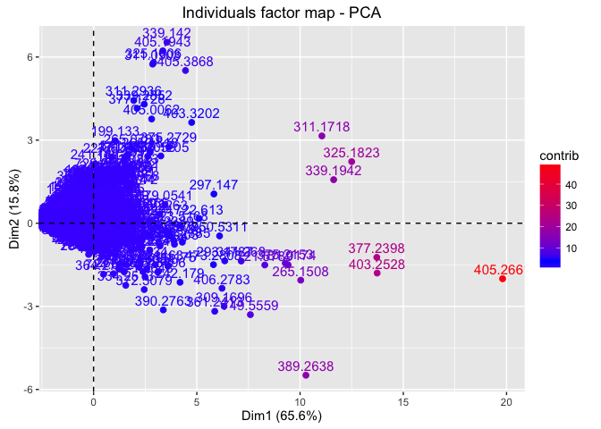
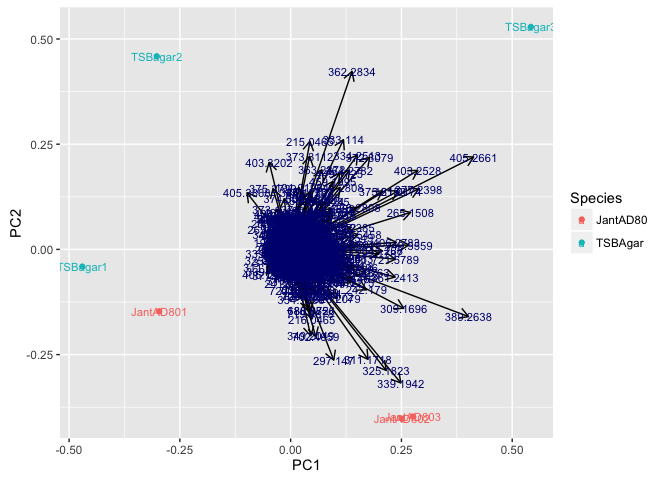
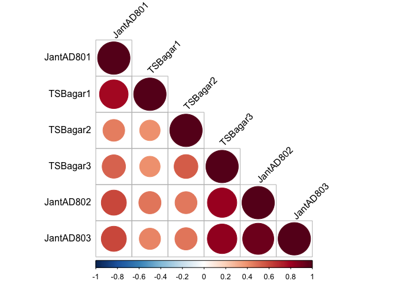
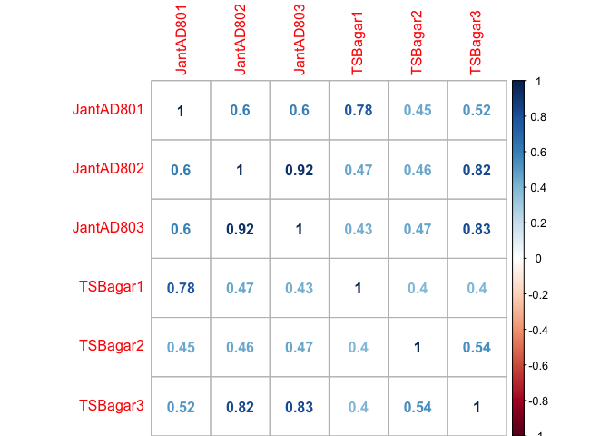

Multivariate Analysis Steps for Feature Matrix JantAD80 TSB
================

Author: Purva Kulkarni Date: 13 July 2016

This documents contains code snippets to perform multivariate analysis performed on the feature matrix Serratia TSB obtained after preprocessed the MS peaklists for Serratia and TSB agar (Code for preprocessing: `processPeaklists.R`. The preprocessing steps do contain steps perform alignment and calibration. The parameters for baseline correction and peak detection are fine tuned.

Read the `FeatureMatrix_JantAD80_TSB.csv`, create column and row headers and view

``` r
data <- read.csv("FeatureMatrix_JantAD80_TSB.csv", header = TRUE)
data2 <- cbind(data$V1, data$V2, data$V3, data$V4, data$V5, data$V6, data$V7, data$V8, data$V9)
colnames(data2) <- c("JantAD801", "JantAD802", "JantAD803", "TSBagar1", "TSBagar2", "TSBagar3")
temp1 <- c(data$X)
temp1 <- as.character(round(temp1, digits = 4))
rownames(data2) <- temp1
head(data2)
```

    ##          JantAD801 JantAD802  JantAD803   TSBagar1 TSBagar2  TSBagar3
    ## 150.0128 0.2374661 5.0583301 0.71915305 15.1358193        0 0.0000000
    ## 150.2367 0.4575077 0.4898127 0.66587079  0.3292438        0 0.6424956
    ## 150.5027 0.5348573 0.8220462 0.00000000  0.3327653        0 0.5357380
    ## 150.5795 1.7228395 1.0310194 0.05317294  0.8951154        0 0.2908138
    ## 150.6594 2.1623253 0.8873636 0.43816244  2.6592844        0 0.2598099
    ## 150.8854 3.1889920 2.8897966 0.80573752  5.3876118        0 0.0000000

View pair wise scatter plots and their correlations

``` r
panel.cor <- function(x, y, digits=2, prefix="", cex.cor) 
{
  usr <- par("usr"); on.exit(par(usr)) 
  par(usr = c(0, 1, 0, 1)) 
  r <- abs(cor(x, y)) 
  txt <- format(c(r, 0.123456789), digits=digits)[1] 
  txt <- paste(prefix, txt, sep="") 
  if(missing(cex.cor)) cex <- 0.8/strwidth(txt) 
  
  test <- cor.test(x,y) 
  # borrowed from printCoefmat
  Signif <- symnum(test$p.value, corr = FALSE, na = FALSE, 
                   cutpoints = c(0, 0.001, 0.01, 0.05, 0.1, 1),
                   symbols = c("***", "**", "*", ".", " ")) 
  
  text(0.5, 0.5, txt, cex = cex * r) 
  text(.8, .8, Signif, cex=cex, col=2) 
}
pairs(data2, lower.panel=panel.smooth, upper.panel=panel.cor)
```



Visualize the contribution to the overall variance from individual mass values

``` r
library(factoextra)
```

    ## Loading required package: ggplot2

    ## Warning: package 'ggplot2' was built under R version 3.2.4

``` r
res.pca <- prcomp(data2,  scale = TRUE)
fviz_pca_ind(res.pca, col.ind="contrib") +
scale_color_gradient2(low="white", mid="blue",
high="red", midpoint=4)
```



Transform the `data2` matrix, convert the matrx to a `data.frame` and add a `Species` column to the this matrix.

``` r
data2Transformed <- t(data2)
Species <- c("JantAD80", "JantAD80", "JantAD80", "TSBAgar", "TSBAgar", "TSBAgar")
data2Transformed <- as.data.frame(data2Transformed)
Species <- as.factor(Species)
data2Transformed <- cbind(data2Transformed, Species)
df <- data2Transformed[c(1:length(data2Transformed)-1)]
library(ggfortify)
```

    ## Warning: package 'ggfortify' was built under R version 3.2.5

``` r
autoplot(prcomp(df), data = data2Transformed, colour = 'Species', label  =TRUE, label.size = 3, loadings = TRUE, loadings.colour = 'black', loadings.label = TRUE, loadings.label.size = 3, loadings.label.colour = 'Navyblue')
```



``` r
summary(prcomp(df))
```

    ## Importance of components:
    ##                             PC1      PC2       PC3      PC4       PC5
    ## Standard deviation     704.9605 327.8221 231.83514 158.5113 149.71710
    ## Proportion of Variance   0.7042   0.1523   0.07616   0.0356   0.03176
    ## Cumulative Proportion    0.7042   0.8565   0.93264   0.9682   1.00000
    ##                              PC6
    ## Standard deviation     1.836e-13
    ## Proportion of Variance 0.000e+00
    ## Cumulative Proportion  1.000e+00

On performing correlation analysis, it still shows some amount of positive correlation amongst samples

``` r
library(corrplot)
```

    ## Warning: package 'corrplot' was built under R version 3.2.5

``` r
source("http://www.sthda.com/upload/rquery_cormat.r")
rquery.cormat(data2)
```



    ## $r
    ##           JantAD801 TSBagar1 TSBagar2 TSBagar3 JantAD802 JantAD803
    ## JantAD801         1                                               
    ## TSBagar1       0.78        1                                      
    ## TSBagar2       0.45      0.4        1                             
    ## TSBagar3       0.52      0.4     0.54        1                    
    ## JantAD802       0.6     0.47     0.46     0.82         1          
    ## JantAD803       0.6     0.43     0.47     0.83      0.92         1
    ## 
    ## $p
    ##           JantAD801 TSBagar1 TSBagar2 TSBagar3 JantAD802 JantAD803
    ## JantAD801         0                                               
    ## TSBagar1          0        0                                      
    ## TSBagar2          0        0        0                             
    ## TSBagar3          0        0        0        0                    
    ## JantAD802         0        0        0        0         0          
    ## JantAD803         0        0        0        0         0         0
    ## 
    ## $sym
    ##           JantAD801 TSBagar1 TSBagar2 TSBagar3 JantAD802 JantAD803
    ## JantAD801 1                                                       
    ## TSBagar1  ,         1                                             
    ## TSBagar2  .         .        1                                    
    ## TSBagar3  .         .        .        1                           
    ## JantAD802 .         .        .        +        1                  
    ## JantAD803 .         .        .        +        *         1        
    ## attr(,"legend")
    ## [1] 0 ' ' 0.3 '.' 0.6 ',' 0.8 '+' 0.9 '*' 0.95 'B' 1

``` r
cor.data2 <- cor(data2)
corrplot(cor.data2, method = "number")
```


