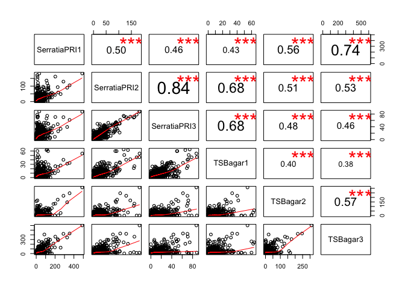
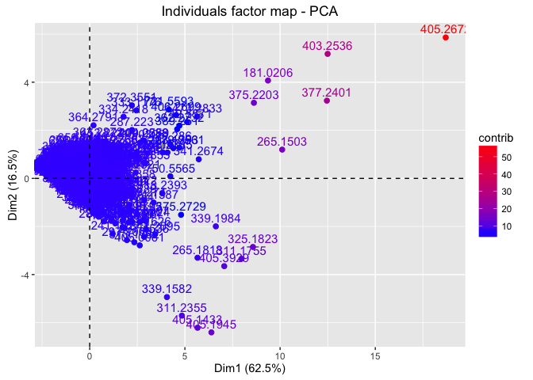
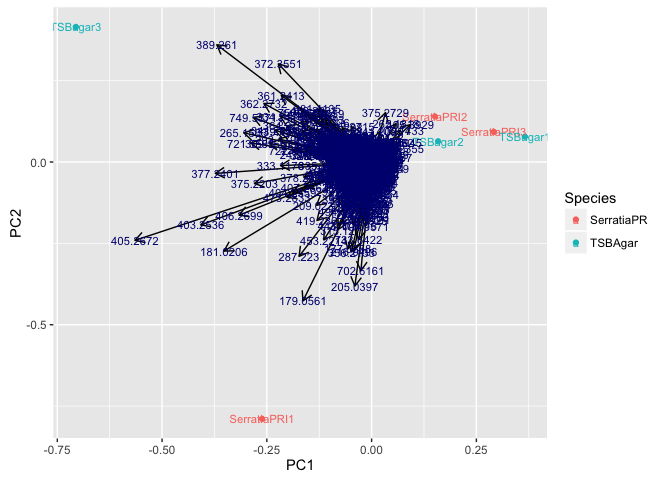
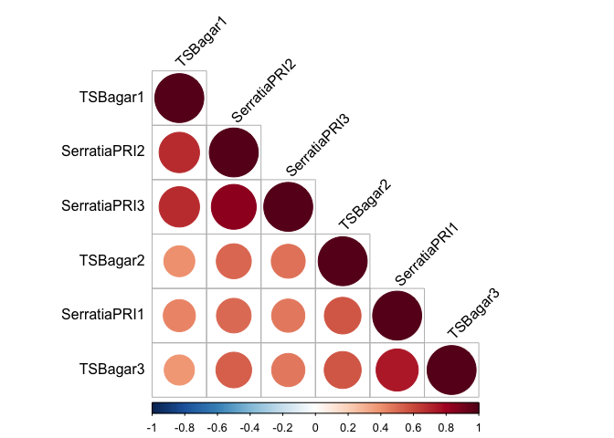
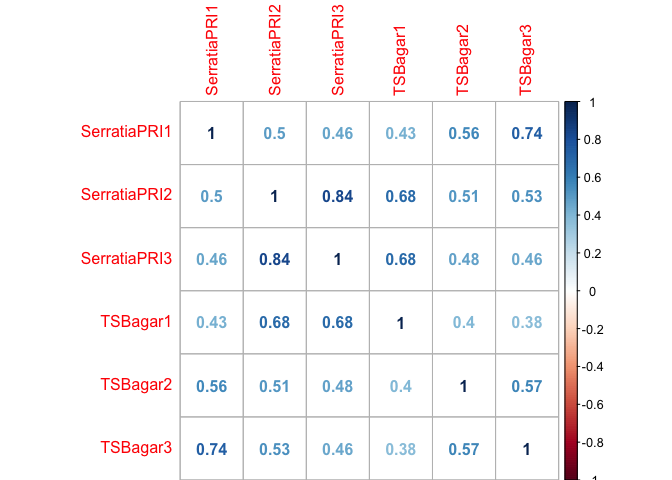

Multivariate Analysis Steps for Feature Matrix Serratia TSB
================

Author: Purva Kulkarni Date: 13 July 2016

This documents contains code snippets to perform multivariate analysis performed on the feature matrix Serratia TSB obtained after preprocessed the MS peaklists for Serratia and TSB agar (Code for preprocessing: `processPeaklists.R`. The preprocessing steps do contain steps perform alignment and calibration. The parameters for baseline correction and peak detection are fine tuned.

Read the `featureMatrix_Serratia_TSB.csv`, create column and row headers and view

``` r
data <- read.csv("FeatureMatrix_Serratia_TSB.csv", header = TRUE)
data2 <- cbind(data$V1, data$V2, data$V3, data$V4, data$V5, data$V6)
colnames(data2) <- c("SerratiaPRI1", "SerratiaPRI2", "SerratiaPRI3", "TSBagar1", "TSBagar2", "TSBagar3")
temp1 <- c(data$X)
temp1 <- as.character(round(temp1, digits = 4))
rownames(data2) <- temp1
head(data2)
```

    ##          SerratiaPRI1 SerratiaPRI2 SerratiaPRI3  TSBagar1 TSBagar2
    ## 150.0019    20.431528   0.00000000    0.0000000 15.135819 0.000000
    ## 150.3529     1.989367   0.81234445    0.1477674  0.000000 0.000000
    ## 150.6221     2.833047   0.07407513    2.9525497  2.282073 0.000000
    ## 150.9769    25.704326   6.26245300    6.0913385  6.234321 1.520942
    ## 151.4625     6.368061   0.16656480    0.1199740  0.234598 1.318867
    ## 152.0518     6.387684   0.37998591    1.0387084  2.577211 1.073663
    ##            TSBagar3
    ## 150.0019  0.0000000
    ## 150.3529  0.8545647
    ## 150.6221  0.2908138
    ## 150.9769 29.4021088
    ## 151.4625  0.6920175
    ## 152.0518  0.9325008

View pair wise scatter plots and their correlations

``` r
panel.cor <- function(x, y, digits=2, prefix="", cex.cor) 
{
  usr <- par("usr"); on.exit(par(usr)) 
  par(usr = c(0, 1, 0, 1)) 
  r <- abs(cor(x, y)) 
  txt <- format(c(r, 0.123456789), digits=digits)[1] 
  txt <- paste(prefix, txt, sep="") 
  if(missing(cex.cor)) cex <- 0.8/strwidth(txt) 
  
  test <- cor.test(x,y) 
  # borrowed from printCoefmat
  Signif <- symnum(test$p.value, corr = FALSE, na = FALSE, 
                   cutpoints = c(0, 0.001, 0.01, 0.05, 0.1, 1),
                   symbols = c("***", "**", "*", ".", " ")) 
  
  text(0.5, 0.5, txt, cex = cex * r) 
  text(.8, .8, Signif, cex=cex, col=2) 
}
pairs(data2, lower.panel=panel.smooth, upper.panel=panel.cor)
```



Visualize the contribution to the overall variance from individual mass values

``` r
library(factoextra)
```

    ## Loading required package: ggplot2

    ## Warning: package 'ggplot2' was built under R version 3.2.4

``` r
res.pca <- prcomp(data2,  scale = TRUE)
fviz_pca_ind(res.pca, col.ind="contrib") +
scale_color_gradient2(low="white", mid="blue",
high="red", midpoint=4)
```



Transform the `data2` matrix, convert the matrx to a `data.frame` and add a `Species` column to the this matrix.

``` r
data2Transformed <- t(data2)
Species <- c("SerratiaPR", "SerratiaPR", "SerratiaPR", "TSBAgar", "TSBAgar", "TSBAgar")
data2Transformed <- as.data.frame(data2Transformed)
Species <- as.factor(Species)
data2Transformed <- cbind(data2Transformed, Species)
df <- data2Transformed[c(1:length(data2Transformed)-1)]
library(ggfortify)
```

    ## Warning: package 'ggfortify' was built under R version 3.2.5

``` r
autoplot(prcomp(df), data = data2Transformed, colour = 'Species', label  =TRUE, label.size = 3, loadings = TRUE, loadings.colour = 'black', loadings.label = TRUE, loadings.label.size = 3, loadings.label.colour = 'Navyblue')
```



``` r
summary(prcomp(df))
```

    ## Importance of components:
    ##                             PC1     PC2       PC3       PC4     PC5
    ## Standard deviation     676.5834 288.944 237.57590 171.38128 72.4600
    ## Proportion of Variance   0.7239   0.132   0.08926   0.04645  0.0083
    ## Cumulative Proportion    0.7239   0.856   0.94525   0.99170  1.0000
    ##                              PC6
    ## Standard deviation     1.349e-13
    ## Proportion of Variance 0.000e+00
    ## Cumulative Proportion  1.000e+00

On performing correlation analysis, it still shows some amount of positive correlation amongst samples

``` r
library(corrplot)
```

    ## Warning: package 'corrplot' was built under R version 3.2.5

``` r
source("http://www.sthda.com/upload/rquery_cormat.r")
rquery.cormat(data2)
```



    ## $r
    ##              TSBagar1 SerratiaPRI2 SerratiaPRI3 TSBagar2 SerratiaPRI1
    ## TSBagar1            1                                                
    ## SerratiaPRI2     0.68            1                                   
    ## SerratiaPRI3     0.68         0.84            1                      
    ## TSBagar2          0.4         0.51         0.48        1             
    ## SerratiaPRI1     0.43          0.5         0.46     0.56            1
    ## TSBagar3         0.38         0.53         0.46     0.57         0.74
    ##              TSBagar3
    ## TSBagar1             
    ## SerratiaPRI2         
    ## SerratiaPRI3         
    ## TSBagar2             
    ## SerratiaPRI1         
    ## TSBagar3            1
    ## 
    ## $p
    ##              TSBagar1 SerratiaPRI2 SerratiaPRI3 TSBagar2 SerratiaPRI1
    ## TSBagar1            0                                                
    ## SerratiaPRI2        0            0                                   
    ## SerratiaPRI3        0            0            0                      
    ## TSBagar2            0            0            0        0             
    ## SerratiaPRI1        0            0            0        0            0
    ## TSBagar3            0            0            0        0            0
    ##              TSBagar3
    ## TSBagar1             
    ## SerratiaPRI2         
    ## SerratiaPRI3         
    ## TSBagar2             
    ## SerratiaPRI1         
    ## TSBagar3            0
    ## 
    ## $sym
    ##              TSBagar1 SerratiaPRI2 SerratiaPRI3 TSBagar2 SerratiaPRI1
    ## TSBagar1     1                                                       
    ## SerratiaPRI2 ,        1                                              
    ## SerratiaPRI3 ,        +            1                                 
    ## TSBagar2     .        .            .            1                    
    ## SerratiaPRI1 .        .            .            .        1           
    ## TSBagar3     .        .            .            .        ,           
    ##              TSBagar3
    ## TSBagar1             
    ## SerratiaPRI2         
    ## SerratiaPRI3         
    ## TSBagar2             
    ## SerratiaPRI1         
    ## TSBagar3     1       
    ## attr(,"legend")
    ## [1] 0 ' ' 0.3 '.' 0.6 ',' 0.8 '+' 0.9 '*' 0.95 'B' 1

``` r
cor.data2 <- cor(data2)
corrplot(cor.data2, method = "number")
```


