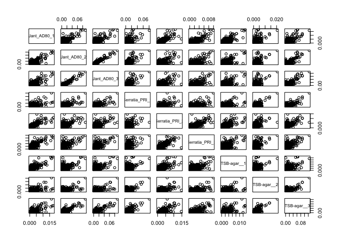
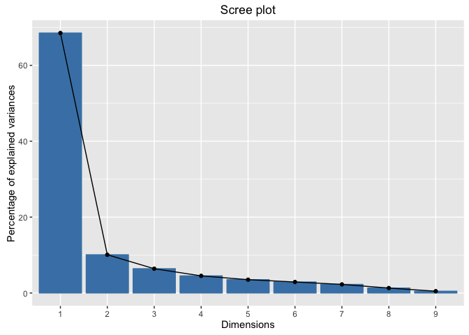
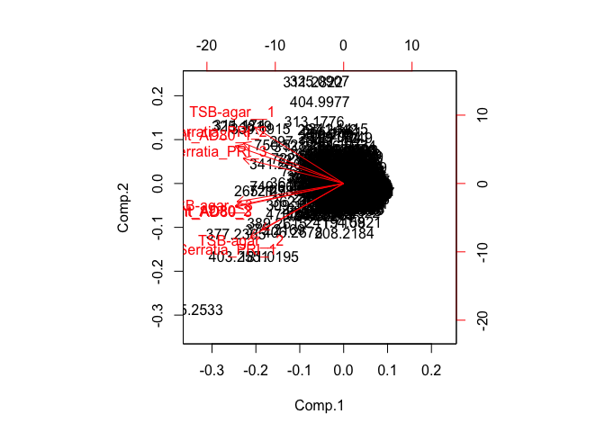
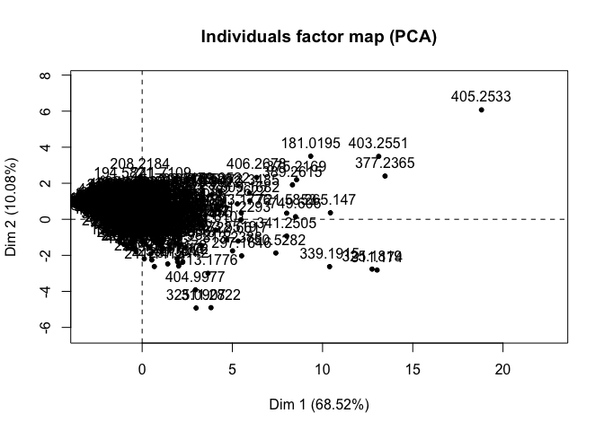
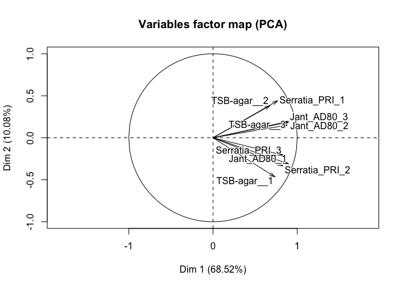
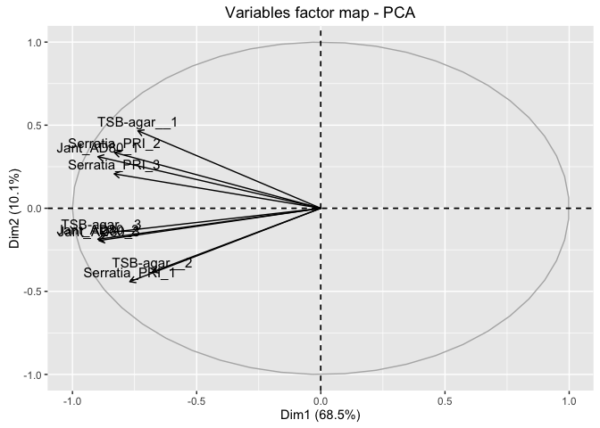
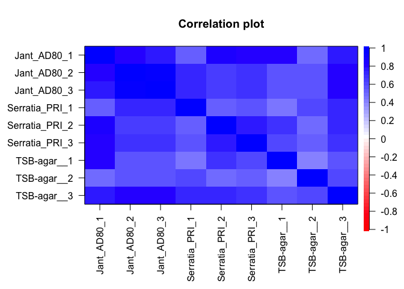

Multivariate Analysis Steps
================

Author: Purva Kulkarni Date: 7 July 2016

This documents contains code snippets to perform multivariate analysis performed on the feature matrix obtained after preprocessed the MS peaklists (Code for preprocessing: `processPeaklists.R`.

Read the featureMatrix from the .csv file, create column and row headers and view

``` r
data <- read.csv("FeatureMatrix.csv", header = TRUE)
data2 <- cbind(data$V1, data$V2, data$V3, data$V4, data$V5, data$V6, data$V7, data$V8, data$V9)
colnames(data2) <- c("Jant_AD80_1", "Jant_AD80_2", "Jant_AD80_3", "Serratia_PRI_1", "Serratia_PRI_2", "Serratia_PRI_3", "TSB-agar__1", "TSB-agar__2", "TSB-agar__3")
temp1 <- c(data$X)
temp1 <- as.character(round(temp1, digits = 4))
rownames(data2) <- temp1
head(data2)
```

    ##           Jant_AD80_1  Jant_AD80_2  Jant_AD80_3 Serratia_PRI_1
    ## 150.975  3.899903e-04 0.0014935550 1.700109e-03    0.005057726
    ## 152.9903 1.998909e-04 0.0018814787 2.649620e-03    0.011670320
    ## 157.1126 8.299503e-05 0.0062617731 5.648421e-05    0.008600066
    ## 162.906  5.454159e-04 0.0022078695 1.392162e-03    0.004584687
    ## 165.0001 8.802229e-04 0.0008915982 5.381649e-03    0.005889142
    ## 167.0075 2.035804e-03 0.0056464616 7.354999e-03    0.010338924
    ##          Serratia_PRI_2 Serratia_PRI_3 TSB-agar__1  TSB-agar__2
    ## 150.975    5.539921e-04   0.0008108493 0.001840960 0.0000000000
    ## 152.9903   3.841150e-04   0.0007331449 0.001423360 0.0002402718
    ## 157.1126   3.643835e-05   0.0006280611 0.003493331 0.0002228560
    ## 162.906    7.300829e-04   0.0014590671 0.001272414 0.0003010066
    ## 165.0001   2.491027e-03   0.0017156463 0.002199072 0.0002865069
    ## 167.0075   2.705353e-03   0.0019288044 0.002647678 0.0002793718
    ##           TSB-agar__3
    ## 150.975  0.0060254452
    ## 152.9903 0.0023078040
    ## 157.1126 0.0001711102
    ## 162.906  0.0002155402
    ## 165.0001 0.0040993373
    ## 167.0075 0.0104113590

View a matrix of pairwise scatter plots for the data

``` r
pairs(data2)
```



Perform PCA on the feature matrix and view the pca summary, scree plot and score plot

``` r
data2.pca1 <- princomp(data2, scores = TRUE, cor = TRUE)
summary(data2.pca1)
```

    ## Importance of components:
    ##                          Comp.1    Comp.2     Comp.3    Comp.4     Comp.5
    ## Standard deviation     2.483328 0.9525090 0.75930430 0.6376373 0.56248986
    ## Proportion of Variance 0.685213 0.1008082 0.06406034 0.0451757 0.03515498
    ## Cumulative Proportion  0.685213 0.7860212 0.85008151 0.8952572 0.93041219
    ##                            Comp.6     Comp.7     Comp.8      Comp.9
    ## Standard deviation     0.51127728 0.45181291 0.34328825 0.207133014
    ## Proportion of Variance 0.02904494 0.02268166 0.01309409 0.004767121
    ## Cumulative Proportion  0.95945713 0.98213879 0.99523288 1.000000000

``` r
library(factoextra)
```

    ## Warning: package 'factoextra' was built under R version 3.2.5

    ## Loading required package: ggplot2

    ## Warning: package 'ggplot2' was built under R version 3.2.4

``` r
fviz_screeplot(data2.pca1)
```



``` r
biplot(data2.pca1)
```



``` r
library(FactoMineR)
```

    ## Warning: package 'FactoMineR' was built under R version 3.2.5

``` r
result <- PCA(data2)
```



Visualization of the variables on a factor map

``` r
fviz_pca_var(data2.pca1)
```



Visualization of correlation plot for the different samples

``` r
library(psych)
```

    ## Warning: package 'psych' was built under R version 3.2.5

    ## 
    ## Attaching package: 'psych'

    ## The following objects are masked from 'package:ggplot2':
    ## 
    ##     %+%, alpha

``` r
data2.cor1 <- cor(data2)
corPlot(data2.cor1)
```


